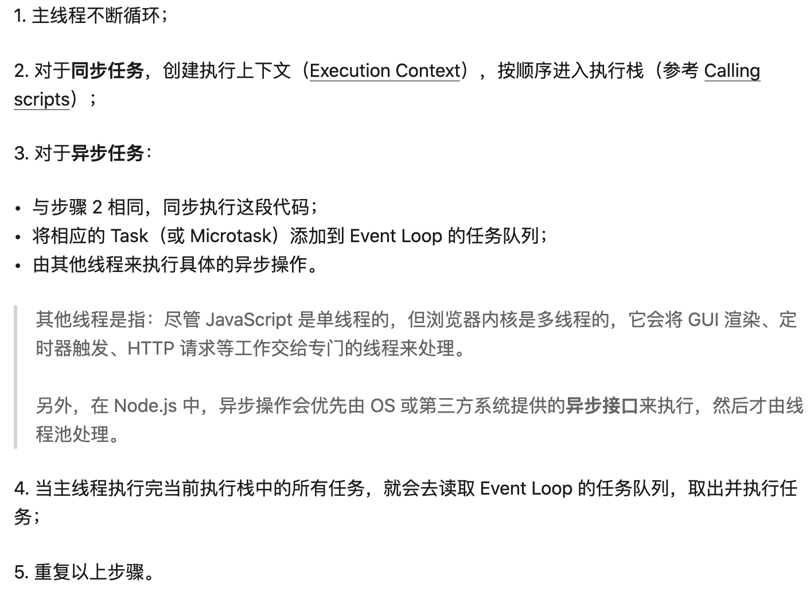
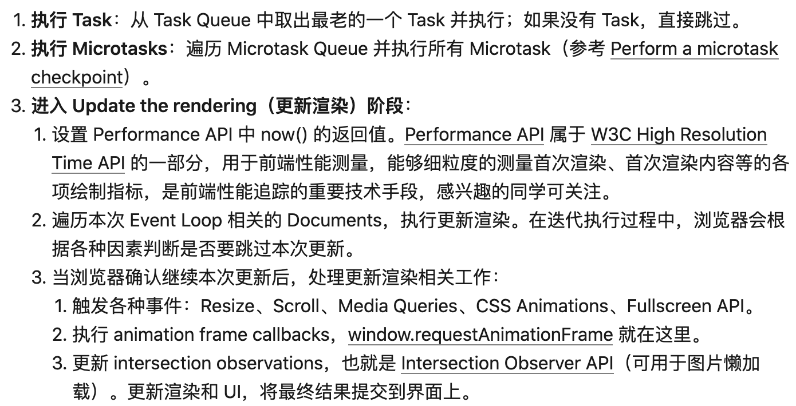

# Event Loop

## 定义
+ `JavaScript`是一种单线程的编程语言，只有一个调用栈，决定了它在同一时间只能做一件事情
+ 如果一段同步的代码耗时非常久就会阻塞GUI的渲染
+ `Event Loop`翻译出来就是事件循环，是让`JavaScript`做到既是单线程，又绝对不会阻塞的核心机制，也是`JavaScript`并发模型的基础，是用来协调`各种事件`、`用户交互`、`脚本执行`、`UI渲染`、`网络请求`等的一种机制，也是一种**协程**

## JavaScript运行环境
+ 浏览器
+ 服务端（Node.js）
+ 客户端（Visual Studio Code）

## JavaScript Runtime


## Task（宏任务，也称为MacroTask）
:::tip
一个`Event Loop`内存在多个`Task Queue`
:::

常见的`Task Source`：
+ script全部代码
+ setTimeout
+ setInterval
+ setImmediate
+ DOM操作
+ 用户交互
+ 网络请求
+ History API 操作

## MicroTask（微任务）
:::tip
`Event Loop`里只有一个`Microtask Queue`
:::

常见的`Task Source`：
+ Process.nextTick（Node独有）
+ Promise
+ MutationObserver

## 浏览器运行环境
<table>
    <thead>
        <tr>
            <th colspan="2">浏览器内核</th>
        </tr>
    </thead>
    <tbody>
        <tr>
            <td>JavaScript线程</td>
            <td>
                <ul>
                    <li>负责执行执行栈的最顶层 JS 代码</li>
                    <li>和 GUI 渲染线程互斥，JS 运行耗时过长就会导致页面阻塞</li>
                </ul>
            </td>
        </tr>
        <tr>
            <td>GUI线程</td>
            <td>
                <ul>
                    <li>负责渲染页面,解析 HTML，CSS 构成 DOM 树等，当页面重绘或者由于某种操作引起回流都会调起该线程</li>
                    <li>和 JS 引擎线程是互斥的，当 JS 引擎线程在工作的时候，GUI 渲染线程会被挂起，GUI 更新被放入在 JS 任务队列中，等待 JS 引擎线程空闲的时候继续执行</li>
                </ul>
            </td>
        </tr>
        <tr>
            <td>事件监听线程</td>
            <td>
                <ul>
                    <li>当事件符合触发条件被触发时，该线程会把对应的事件回调函数添加到事件队列的队尾，等待 JS 引擎处理</li>
                </ul>
            </td>
        </tr>
        <tr>
            <td>计时线程</td>
            <td>
                <ul>
                    <li>开启定时器触发线程来计时并触发计时，计时完毕后，将计时器结束的回调函数添加到事件队列中，等待JS引擎空闲后执行，等待 JS 引擎处理</li>
                    <li>浏览器定时计数器并不是由 JS 引擎计数的，阻塞会导致计时不准确</li>
                </ul>
            </td>
        </tr>
        <tr>
            <td>网络线程</td>
            <td>
                <ul>
                    <li>Http 请求的时候会开启一条请求线程</li>
                    <li>请求完成有结果了之后，将请求的 Http 回调函数添加到任务队列中，等待 JS 引擎处理</li>
                </ul>
            </td>
        </tr>
    </tbody>
</table>

### 浏览器内的Event Loop
:::tip
`Task`和`MicroTask`均使用队列管理执行顺序，即**先进先出（FIFO）**
:::

1. 在`tasks`队列中选择最老的一个`task`,用户代理可以选择任何`task`队列，如果没有可选的任务，则跳到下边的`microtasks`步骤
1. 将上边选择的`task`设置为正在运行的`task`
1. Run: 运行被选择的`task`
1. 将`Event Loop`的`currently running task`变为`null`
1. 从`task`队列里移除前边运行的`task`
1. Microtasks: 执行`microtasks`任务检查点（也就是执行microtasks队列里的任务）
1. 更新渲染（Update the rendering）...
1. 如果这是一个`worker event loop`，但是没有任务在`task`队列中，并且`WorkerGlobalScope`对象的`closing`标识为`true`，则销毁`Event Loop`，中止这些步骤，然后进行定义在`Web workers`章节的`run a worker`
1. 返回到第一步

### microtasks检查点
::: tip
+ 当**上下文执行栈为空**时，执行一个`microtask checkpoint`
+ 在`Event Loop`的第六步（Microtasks: Perform a microtask checkpoint）执行`checkpoint`，也就是在运行`task`之后，更新渲染之前
:::

1. 将`microtask checkpoint`的`flag`设为`true`
1. Microtask queue handling: 如果`Event Loop`的`microtask`队列为空，直接跳到第八步（Done）
1. 在`microtask`队列中选择最老的一个任务
1. 将上一步选择的任务设为`Event Loop`的`currently running task`
1. 运行选择的任务
1. 将`Event Loop`的`currently running task`变为`null`
1. 将前面运行的`microtask`从`microtask`队列中删除，然后返回到第二步（Microtask queue handling）
1. Done: 每一个`environment settings object`它们的`responsible event loop`就是当前的`Event Loop`，会给`environment settings object`发一个`rejected promises`的通知
1. 清理`IndexedDB`的事务
1. 将`microtask checkpoint`的`flag`设为`flase`

### 浏览器内的Event Loop简易流程


### Promise在不同浏览器的差异问题
`Promise`的定义在**ECMAScript规范**而不是在**HTML Standard 规范**中。在[Promises/A+规范](https://promisesaplus.com/#notes)中提及了`Promise`的`then`方法可以采用`宏任务（macro-task）`机制或者`微任务（micro-task）`机制来实现。所以`Promise`在不同浏览器的差异正源于此，有的浏览器将`then`放入了`macro-task`队列，有的放入了`micro-task`队列

### 例子
```js
console.log('script start')

async function async1() {
  await async2()
  console.log('async1 end')
}
async function async2() {
  console.log('async2 end')
}
async1()

setTimeout(function() {
  console.log('setTimeout')
}, 0)

new Promise(resolve => {
  console.log('Promise')
  resolve()
})
  .then(function() {
    console.log('promise1')
  })
  .then(function() {
    console.log('promise2')
  })

console.log('script end')
```
+ js代码运行，调用`async1`函数
    + 调用`async2`函数
        + `async2`函数是一个`async`函数，会转化为`Promise`并立即执行`await`右侧的代码
        + 打印 **async2 end**
    + 遇到`await`后，后面的代码会被转换为`then`内执行，即：
        ```js
        .then(function () {
            console.log('async1 end')
        })
        ```
    + `then`内的函数会加入`microtasks`
    + microtasks: ['async1 end'] / tasks: [ ]
+ js代码继续运行，遇到setTimeout
    + `setTimeout`的回调函数会加入`tasks`
    + microtasks: ['async1 end'] / tasks: ['setTimeout']
+ js代码继续运行
    + `new Promise`内的回调函数会立即执行
        + 打印 **Promise**
        + 调用`resolve`会执行`then`函数
    + `then`内的函数会加入`microtasks`
    + microtasks: ['async1 end', 'promise1', 'promise2'] / tasks: ['setTimeout']
+ js代码继续运行
    + 打印 **script end**
+ 此时js线程空闲
    + 找到`microtasks`队列，发现队列内有需要执行的任务，根据**先进先出**原则依次执行任务
        + 打印 **async1 end**
        + 打印 **promise1**
        + 打印 **promise2**
    + `microtasks`队列内的任务执行完毕，找到`task`队列，发现队列内有需要执行的任务
        + 打印 **setTimeout**