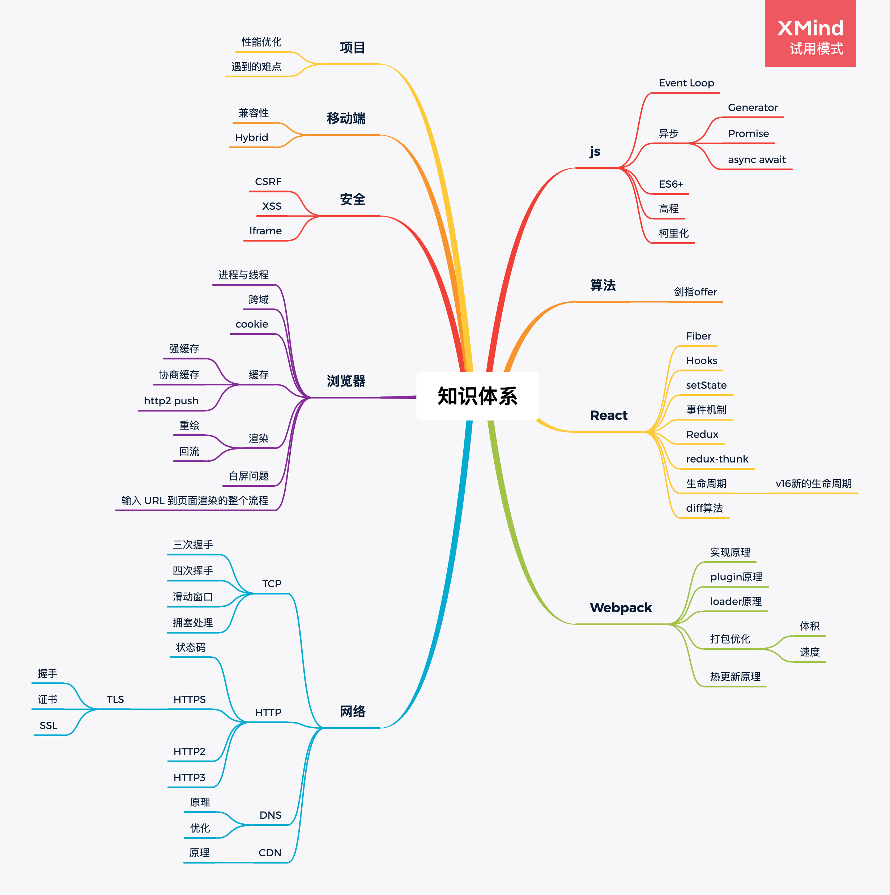

# 面试知识点

## 知识体系

## JavaScript

#### [Event Loop](./JavaScript/EventLoop/)
#### [异步编程](./JavaScript/async/)
#### [ES6](./JavaScript/ES6/)

## React

#### [diff算法](./React/diff算法/)
#### [Hooks](./React/Hooks/)
#### [Redux](./React/Redux/)
#### [React-Redux](./React/React-Redux/)
#### [Redux-Thunk](./React/Redux-Thunk/)

## Vue

#### [Vue](./Vue/Vue/)
#### [Vue-Router](./Vue/Vue-Router/)

## 浏览器

#### [缓存](./浏览器/缓存/)
#### [跨域](./浏览器/跨域/)

## 网络

#### [HTTP](./网络/HTTP)
